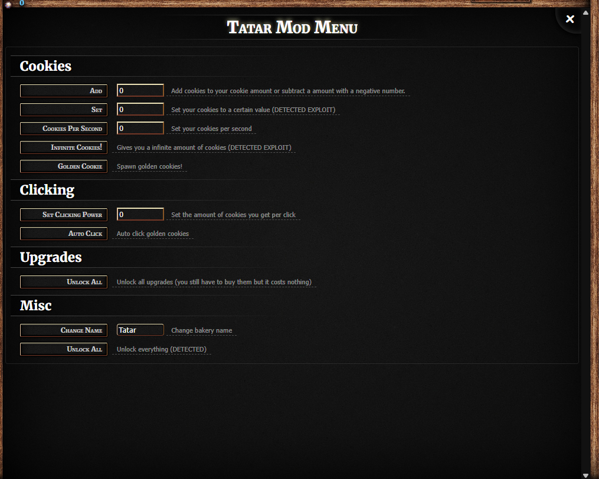

# Tatar Mod Menu 🖥️



# Features

- Add Cookies
- Set Cookies
- Auto click golden cookies
- Spawn Golden Cookies! 
- Change your bakery name
- Unlock all upgrades
- Sleek UI based off cookie clicker

and MUCH more and also a lot more to come in the future :)

# How do I install???

There are many ways you can inject your game with Tatar Mod Menu here are some of the ways

## Bookmarklet (Reccomended)

A bookmarklet is probably one of the most simple ways, so what you do is you go to bookmarklet.js copy the code then make a new bookmark and in the URL section paste the code. Then once you're on Cookie clicker click the bookmark to inject the mod menu

## Console injection

or if you cannot do bookmarklet 

Copy this in the console

```js
const s = document.createElement('script');
s.src = 'https://raw.githubusercontent.com/SomeRandomFella/cookie-clicker-mod-menu/refs/heads/main/inject.js';
document.body.appendChild(s);
```

## CDN jsdeliver

lets say you have cookie clicker on a single file html to play on at school. You can simply copy this js deliver link in the body of the html 
and dont worry! JSdeliver is unblocked in most districts.

```html
    <script> src"=https://cdn.jsdelivr.net/gh/SomeRandomFella/cookie-clicker-mod-menu/inject.js"</script>
```
